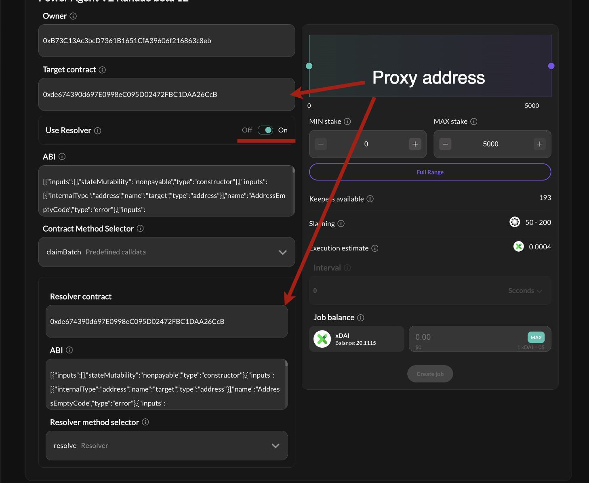

# Staking Rewards Claim Automation On Gnosis Chain

The implementation of staking rewards withdrawals on the [Gnosis Chain differs from Ethereum](https://github.com/gnosischain/specs/blob/master/execution/withdrawals.md), and rewards aren't distributed automatically. Consequently, automating rewards distribution through an application layer protocol becomes essential. This project is motivated by Gnosis validators' desire for automated staking rewards distribution and maintains the opt-in/opt-out approach [proposed by the community](https://forum.gnosis.io/t/stop-autoclaim-for-gc-validators/7168). The repository includes a claim registry contract enabling validators to set claim thresholds and frequencies. For claim execution, the [PowerPool](https://powerpool-finance.ipns.dweb.link/) keepers network is chosen as the most Web3.0 idiomatic approach.

See [implementation details](./src/README.md) for technical overview.


## Setup

### Environment

```shell
forge install
```


```shell
cp .env.example .env
```
*set your environment variables


### Deploy

```shell
source .env

forge script script/Deploy.s.sol:Deploy --rpc-url $GNOSIS_RPC_URL --broadcast --etherscan-api-key $ETHERSCAN_API_KEY --verify --watch
```

### Upgrade

*Proxy address to call is got from `.env` `PROXY_ADDRESS` variable by default, change it if necessary
```shell
forge script script/Upgrade.s.sol:Upgrade --rpc-url $GNOSIS_RPC_URL --broadcast --etherscan-api-key $ETHERSCAN_API_KEY --verify --watch
```

### Docs

```shell
forge doc --serve --port 4000
```

## Job setup

Go to [Power Pool app](https://app-powerpool-finance.ipns.dweb.link/)




1. Create a job on Gnosis chain.
2. Make sure to use resolver condition.
3. Set proxy address for both target contract and resolver contract since ClaimRegistry combine this functionalities. If contracts are verified than you will be able to choose target functions, otherwise paste ABI manually.
4. Job balance may be topped up via UI.


## Deployed contracts

| Name  | Gnosis Mainnet |
| ------------- | ------------- |
| ERC1967 Proxy  | [0x28f1ba1f2Db9Aa0ca4b3B7cD9Ae327f6E872867D](https://gnosisscan.io/address/0x28f1ba1f2Db9Aa0ca4b3B7cD9Ae327f6E872867D#code)  |
| ClaimRegistryUpgradeable (implementation) | [0x72f93d713b45090573ea6699df64c0d13f625d29](https://gnosisscan.io/address/0x955e29346a962b741148cc6b23cc3192afc3844c#code)  |

