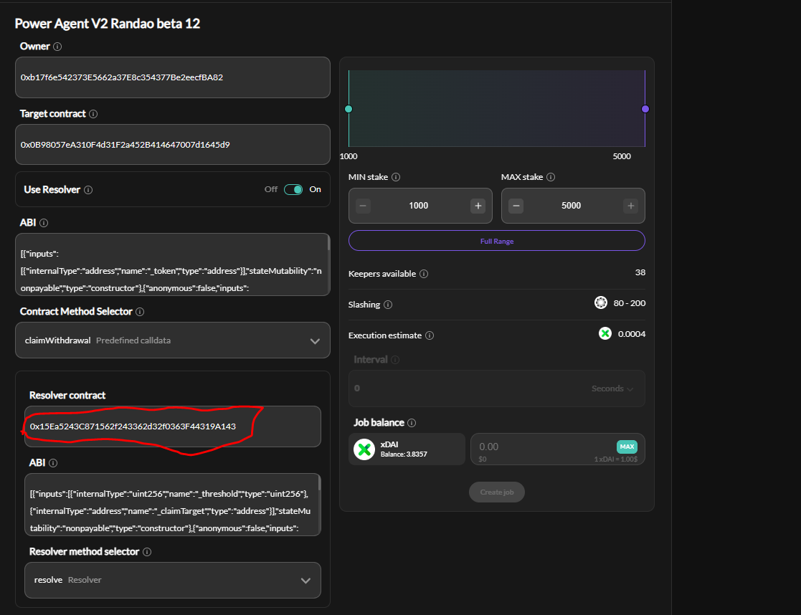

#Validator claim resolver

This repository is dedicated to streamlining a job we have observed one of our testers creating. It automates claiming rewards from the beacon chain deposit. 

Contract addresses:
1. GBC Deposit: 0x0B98057eA310F4d31F2a452B414647007d1645d9
2. The factory: 0x25d3e8058C0A04AAAd6406E4da74d332447357Fc

Utilisation instructions:
1. Invoke the `deployResolver` method of the factory. Select the appropriate threshold. Pass the GBC deposit contract as the `_claimTarget`. 
2. Navigate to https://app.powerpool.finance/#/gnosis/ppv2/my-jobs
3. Create a job as on the picture below (the address encircled in red should be the address of your own resolver):

